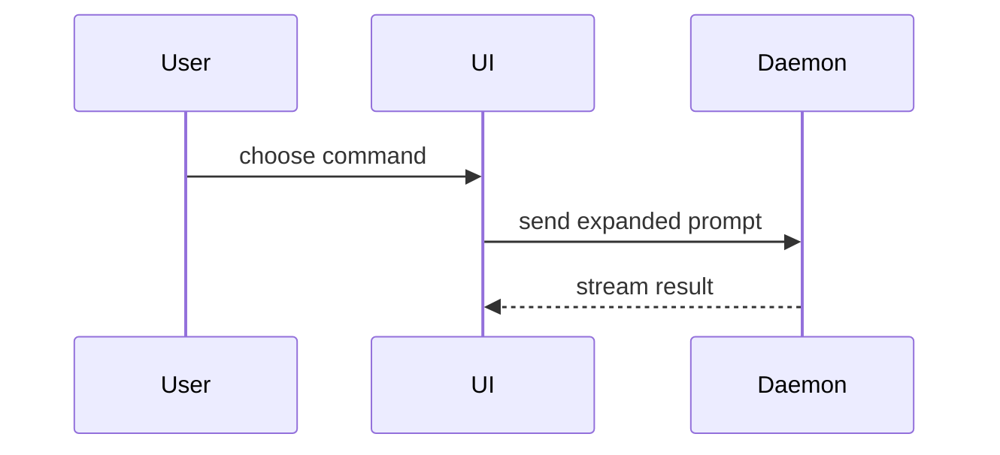

The body is `.github/pull_request_template.md`, filled in:

```markdown
Closes #<n>

## Summary

<a picture of the change: a diagram, a diff sketch or a tree>

## Evidence

- **Before:** <what was drawn, or how a test failed>
  **After:** <what is drawn, or the test passing>

## Merge danger

**Door:** <one-way or two-way>

**Blast radius:** <one word>

<optional: what could break, and for whom>

## Checked

<the template's list, each item answered>
```

## Sections

Skip all preambles and keep prose brief. Use the glossary's words. The story of how the change came to be is in its commits, never here.

### Summary

Pick the smallest view that makes the key point clear.

- Show logic or an algorithm as pseudocode:

```text
on(save)
  if content is unchanged
    return cached result
  write new content
  return fresh result
```

- Show runtime control flow as a call tree:

```text
submitForm
  createSession
    persistPrompt
    launchAgent
  navigateToSession
```

- Show UI structure as a component tree, including state and module boundaries that matter:

```text
<SessionPage> (apps/example/src/routes/session.tsx)
  useSessionEvents()
  <SessionToolbar>
    <RunSkillButton> (packages/ui)
```

- Show file responsibility or a broad refactor as a shallow file tree:

```text
src/
├── commands/       # parses user actions
├── sessions/       # owns session state
└── transport/      # sends API requests
```

- Show component interaction, control flow, or data flow with Mermaid:



- Use `diff` when the point is what changes and the surrounding shape already exists. Match the diff shape to the topic.

For a component change:

```diff
 <SessionPage>
   useSessionEvents()
   <SessionToolbar>
+    <RunSkillButton />
   <SessionTimeline>
+    <SkillResultCard />
```

For a file-layout change:

```diff
 src/
 ├── commands/
+│   └── show-me.ts       # expands the slash command
 ├── sessions/
-└── transport.ts
+└── transport/
+    ├── client.ts
+    └── stream.ts
```

For a call-tree or call-stack change:

```diff
 submitForm
   createSession
     persistPrompt
+    expandSkillMention
     launchAgent
-  navigateToSession
+  navigateToSession
+    subscribeToEvents
```

For a state or control-flow change:

```diff
 on(save)
-  write content
+  if content is unchanged
+    return cached result
+  write new content
+  invalidate cache
```

- Show the whole block when most of it is new, when omitted context would hide ownership or order, or when the user needs a copyable target shape:

```ts
function expandSkill(command: string): string {
  const skillName = command.slice(1);
  return `use the ${skillName} skill`;
}
```

#### Guidance

Place each visual next to the short text it supports. Keep only the calls, files, props, states, and boundaries needed to answer the user's current question or the options to resolve the current discussion point.

You may use one of these, you may use several, it is unlikely you will use all of them. Use your judgement and don't overwhelm the user.

### Evidence

Concrete evidence that the change works, before and after.

- **What a person sees** is the best evidence: the lines drawn before and after, from `drawText` or a `tmux capture-pane` of the branch driven under `dsh --profile binnacle`, in a fenced block.
- **A test red, then green**: its name, and how it failed before, in the failure's own words.
- **For a gate or a script**: its output on the broken case and on the fixed one.

### Merge danger

A **two-way door** is cheap to walk back: a merge reverted. A **one-way door** is not: a change to what `src/api.ts` exports breaks every author, a record renumbered breaks every link to it, a label or an issue published is seen. Say which, and why.

The **blast radius** is who a mistake would reach: the transcript, one feature, every author, the agents' workflow, the upstream job. One word, then what could break where it is not obvious.

### Checked

Each item of the template's list answered, not ticked blank: the reviews by round, with their report's findings and the commits that answered each, since reviews live where GitHub cannot see them; what was driven for real and what it drew; whether the author API changed.
